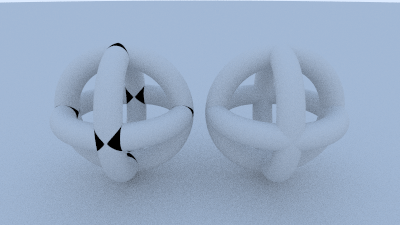
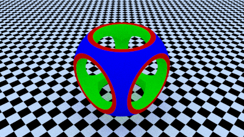

# Ray Tracer in C++

This project is based off the code from the Ray Tracing in One Weekend Series. The code structure has been changed to cleanup the main file and avoid implementation details in the main file. Moreover, the output is directly written to file and does not require output redirection to a file in the console. An ASCII renderer and Constructive Solid Geometry was also implemented.

## Debugging

I have created a `cmake-variants.yaml` for use in `Visual Studio Code`; however, it is still possible to compile the different variants by running `cmake` with the `--config` flag.

Valid configurations:
* Debug
* DebugOptimised
* Release

The `Debug` variant uses no optimisation levels and is therefore suitable for debugging with breakpoints. `DebugOptimised` enables optimisations but keeps `asserts`. `Release` removes the `asserts`.

## Tests

The tests are `bash` script files and the `checksum.txt` have been generated on a `Linux` system. These limitations mean that new scripts would need to be implemented for `Windows` and additional `checksum.txt`'s. The additional checksum would be necessary as some of the examples involve using the builtin random number generator and this differs per platform. The tests can be executed by running `make test --output-on-failure`.

# Constructive Solid Geometry

The library supports constructive solid geometry by using signed distance fields. The operations also support different materials. The signed distance functions were retrieved from [Inigo Quilez](https://iquilezles.org/www/articles/distfunctions/distfunctions.htm).

Supported operations:
* Merge
* Subtraction
* Intersection

Supported Signed Distance Functions:
* Box
* BoxFrame
* BoxRounded
* Cylinder
* Sphere
* Torus

## Example

Two examples are included in the `examples` folder under the `ImplicitFunction` folder.

The first example illustrates the necessity for the `merge` operation by overlapping three tori. The overlapping tori results in shadow acne (black spots on the object on the left) as the intersections are affected by floating-point precision problems. By using the `merge` operation, this problem is avoided.



The seond example illustrates all three supported operations and recreates the figure at [Wikipedia CSG](https://en.wikipedia.org/wiki/Constructive_solid_geometry). It consists of three cylinders, one sphere, and one cube.



# ASCII Renderer

The ASCII renderer converts the images to look like a color ASCII image. The original image is divided into a coarser grid based on the dimensions of the ASCII characters. The mean intensity of the colors in the coarse grid are used to determine which ASCII character should be used for that block. Each pixel in the block can then in parallel draw itself by looking up the Boolean value of the ASCII character's array (see ASCII.h). The original color of the image is returned by using the mean color and multiplying it by the Boolean value.

The implementation converts the image in a block-by-block approach opposed to a scanline approach to improve cache locality, data reuse, and parallelisability.


## Example
```cpp
#include "Image.h"

Image ascii_image = image.to_ascii_image();
ascii_image.save_image("ascii.ppm");
```

# Creating Materials
At present, three materials have been added: Lambertian (diffuse), Metal, and Dielectric. All materials require the albedo to be specified. Metal has an additional roughness parameter and Dielectrics require the index of refraction to be specified. The index of refraction of glass is between 1.3 and 1.7.


## Example
```cpp
#include "Material.h"

auto material_lambertian = std::make_shared<Lambertian>(Color(0.8, 0.8, 0.0));
auto material_metal = std::make_shared<Metal>(Color(0.8, 0.8, 0.8), 0.3);
auto material_dielectric   = std::make_shared<Dielectric>(Color(1,1,1), 1.5);
```

## Textures
Textures have currently been implemented for Lambertian materials only. 

Implemented textures:
* SolidColor
* CheckerTexture
* ImageTexture*

*Image textures must be in uncompressed `.ppm` format (P3).


```cpp
// Create image texture material
auto material_sphere =  std::make_shared<Lambertian>("earthmap.ppm");

// Or to share textures between objects
auto image_texture = std::make_shared<ImageTexture>("earthmap.ppm");
auto material_sphere =  std::make_shared<Lambertian>(image_texture);
```

# Creating a Scene (World) and Adding Objects
A world must be created and then each object should be added to the world. Objects have a position, a size, and a material.

## Example
```cpp
#include "World.h"
#include "Material.h"
#include "ImplicitShape.h"
#include "Vec3.h"

World world;

// Add Lambertian sphere to world
const Point3 position = Point3(0.0, 0.0, -1.0);
const double radius = 0.5;
auto material = std::make_shared<Lambertian>(Color(0.8, 0.8, 0.0));
world.add(std::make_shared<Sphere>(position, radius, material));
```

## Instancing

Instances can be made of objects that share the same material. These instances can then be translated and rotated.

```cpp
#include "Instance.h"
#include "Utility.h" // for degrees_to_radians()

Vec3 offset(1,0,0)
auto translated_sphere = Translation::create(sphere, offset);

// Rotation using axis-angle approach
Vec3 rotation_axis = Vec3(0,0,1);
double rotation_angle = degrees_to_radians(90);
Basis rotated_basis = Basis().rotate(rotation_axis, rotation_angle);
auto rotated_cylinder = Rotation::create(cylinder, rotated_basis); 

Transform transform;
auto transformed_torus = Instance::create(torus, transform);
```

## Hollow Objects
Hollow objects can be created using dielectric materials with a negative radius at the same position as another dielectric material.

```cpp
Point3 position(0.0, 0.0, -1.0);
const double outer_radius = 0.5;
const double inner_radius = -0.4; // note negative sign
world.add(std::make_shared<Sphere>(position, outer_radius, material_dielectric));
world.add(std::make_shared<Sphere>(position, inner_radius, material_dielectric));
```

# Creating a Camera and Ray Tracing the World
To ray trace a scene, a camera needs to be added. The call to `get_image()` rasterises the world scene and performs the ray tracing. The images are gamma corrected ($\gamma$=2) when they are saved to a `.ppm` file. The images are ray traced with stochastic ray positions within a pixel and thus results in a nice antialiased image. However, due to the stochasticity in ray bounces, the images require large amounts of samples per pixel to avoid noisy images. `CameraSettings` and `RenderSettings` are used to reduce the number of parameters required to create a camera and render a scene and provide some defaults for parameters.

## Example
```cpp
#include "Camera.h"
#include "Image.h"

// Set camera position and orientation
Point3 lookfrom(13,2,3);
Point3 lookat(0,0,0);
Vec3 vup(0,1,0);
Transform transform(lookfrom, lookat, vup);

// Set camera settings
CameraSettings camera_settings;
camera_settings.aspect_ratio = 3.0/2.0;
camera_settings.vertical_fov = 20;
const double aperture = 0.1;
const double focus_dist = 10.0;
camera_settings.depth_of_field(aperture, focus_dist);

// Create camera
Camera camera(transform, camera_settings);

// Capture scene
RenderSettings render_settings;
render_settings.samples_per_pixel = 500;
Image image = camera.get_image(world, render_settings);

// Save images to files
image.save_image("ray-traced-image.ppm");
```

# Complex Scenes

The greater the number of objects in the scene, the more important accelerating data structures become. A bounding volume hierarchy (BVH) tree is implemented and takes in a `World` object as input. A BVH tree can only be created when the `World` object contains **2 or more** objects. The BVH tree uses a simple heuristic for splitting: the minimum bounding box coordinate in the selected dimension. Each level of the hierarchy randomly selects the axis to perform the sorting. `RayTracingInOneWeekend` in the `examples` folder demonstrates using the BVH tree in a scene.

## Example
```cpp
World world_objects;
// world_objects.add(object_1)
// ...
// world_objects.add(object_n)

World world;
world.add(BVHNode::create(world_objects));
```